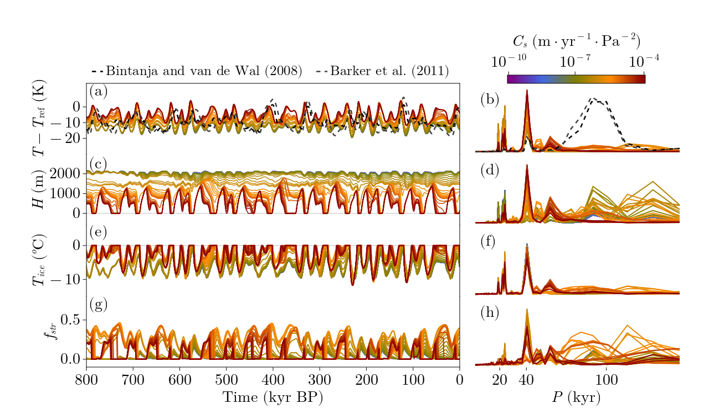

This folder contains the scripts to produce the figures from the paper:

Pérez-Montero, S., Alvarez-Solas, J., Swierczek-Jereczek, J., Moreno-Parada, D., Robinson, A., and Montoya, M.: A simple physical model for glacial cycles, Earth Syst. Dynam., 16, 915–937, https://doi.org/10.5194/esd-16-915-2025, 2025. 

A more complete repository can be found at:

https://github.com/sperezmont/Perez-Montero-etal_2025_ESD

# Figures

Figure 1

Figure 2

Figure 3

Figure 4

Figure 5

Figure 6

Figure 7

Figure 8

Figure 9

Figure 10

Figure 11

Figure 12

Figure 13

Figure 14

Figure 15

Figure 16

Figure 17

Figure A1

Figure A2

Figure A3

Figure B1

